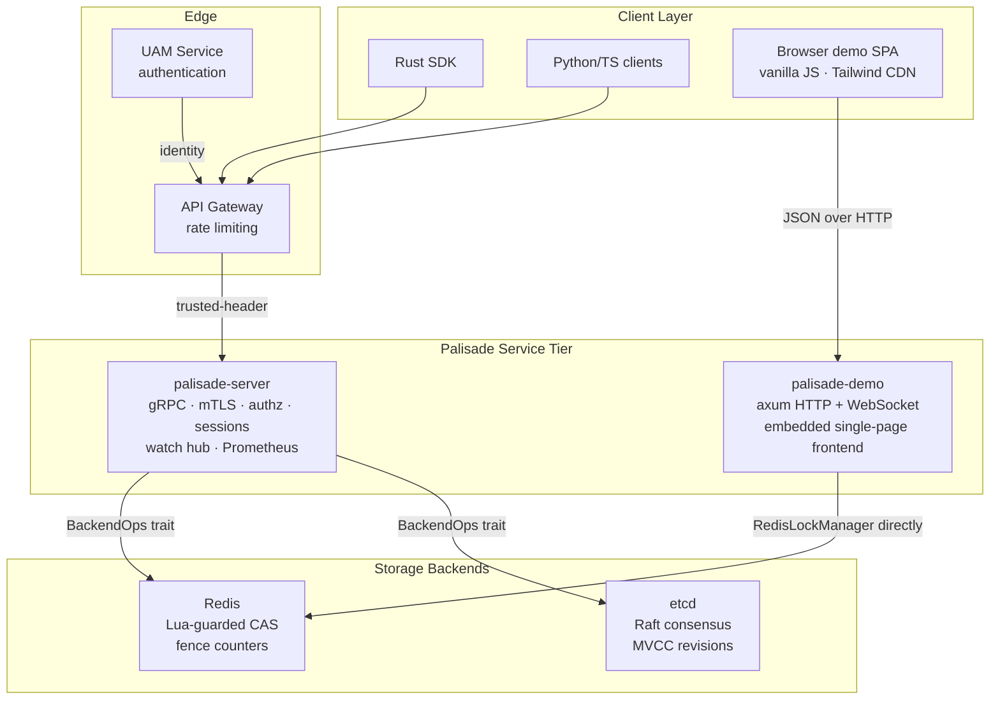
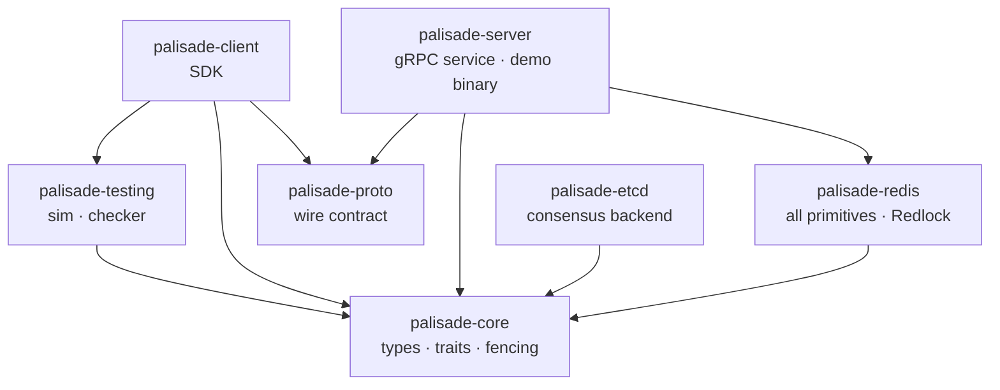
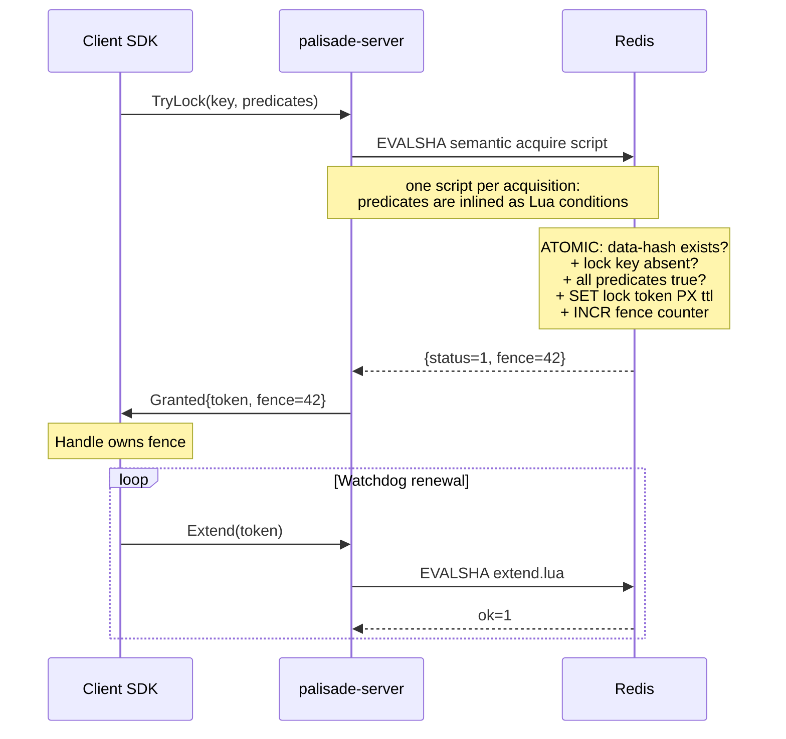
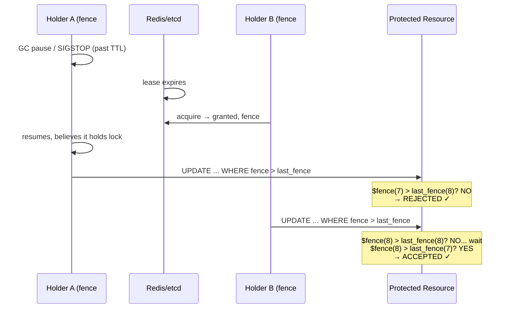
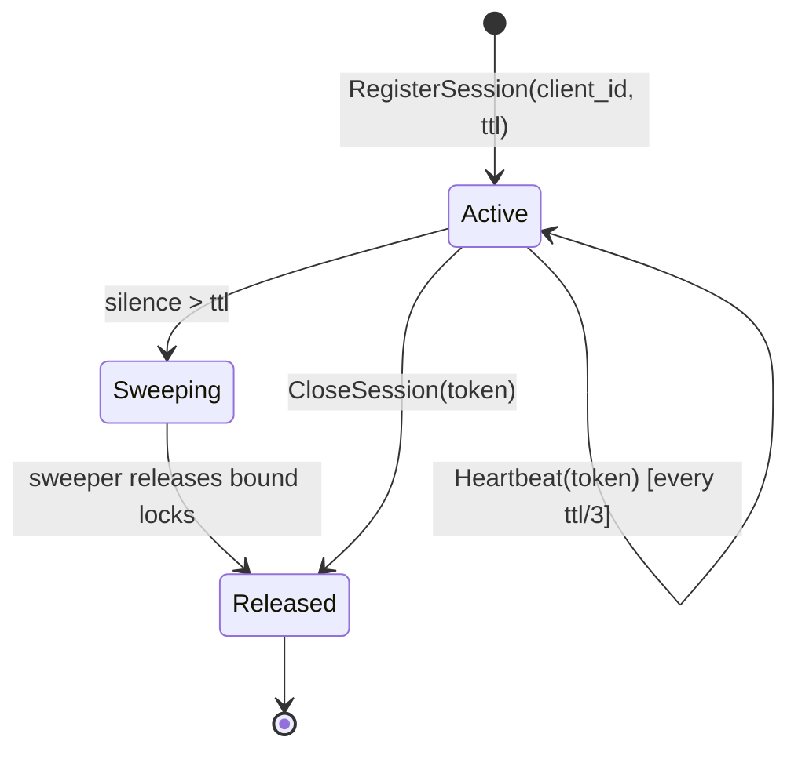
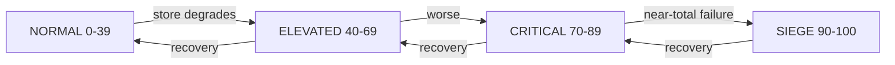
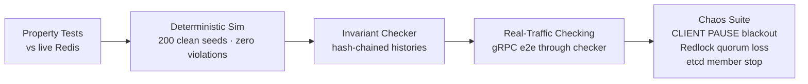
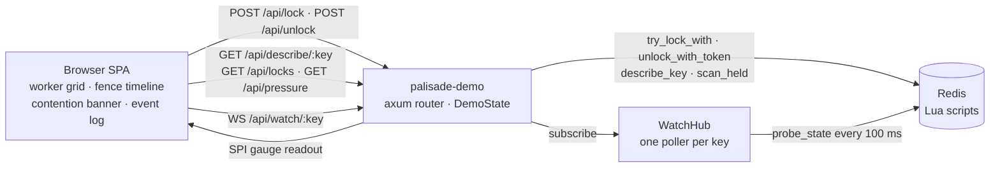

# Architecture

## System Overview

## Crate Dependency Graph

Two edges worth calling out: `palisade-proto` is generated wire code only — it depends on tonic/prost, **not** on core. And `CLIENT → TESTING` is a real dependency: the SDK runs invariant checks over its own live traffic (see the verification pipeline below).

## Request Flow: Semantic Lock Acquisition

## Safety Model: The Fencing Protocol

## Session Lifecycle

## Degradation Tiers (Lock Lattice)

At each tier, consumers adapt:
| Tier | Gateway action | SDK watchdog cadence |
|---|---|---|
| NORMAL | full throughput | ttl/3 (1×) |
| ELEVATED | shed non-critical | ttl/2 (1.5×) |
| CRITICAL | queue new acquires | ttl×1.5 (2×) |
| SIEGE | circuit-break to fallback | ttl×2 (3×) |

## Correctness Verification Pipeline

## Web Demo Surface

The `palisade-demo` binary (same crate as the gRPC server, separate port)
serves an embedded browser UI and a thin REST/WS façade. It adds **no new
locking semantics**: every mutation runs the identical Lua-guarded scripts
through `RedisLockManager`, so the safety arguments of ADRs 0005/0011 apply
unchanged.

| Demo route | Mirrors gRPC | Notes |
|---|---|---|
| `POST /api/lock` | `TryLock` | returns token + fence; watchdog off so expiry is visible |
| `POST /api/unlock` | `Unlock` | ownership-checked release; stale tokens get `lost` |
| `GET /api/describe/{key}` | `DescribeKey` | held + version + remaining TTL |
| `GET /api/locks?prefix=` | `ListLocks` | admin SCAN introspection |
| `WS /api/watch/{key}` | `Watch` | anonymized events via the shared hub |
| `GET /api/pressure` | — | INV-5 Store Pressure Index readout |

Honest fine print for anyone staring at the demo: watch events are
**level-triggered** — the hub polls each key at 100 ms and broadcasts state
*transitions* (ADR 0029), so a grant released between two probes surfaces
only as a version bump on the next `Freed`. Events never carry holder
tokens (ADR 0022); tabs are just subscribers, and N tabs still cost exactly
one poller per watched key.
