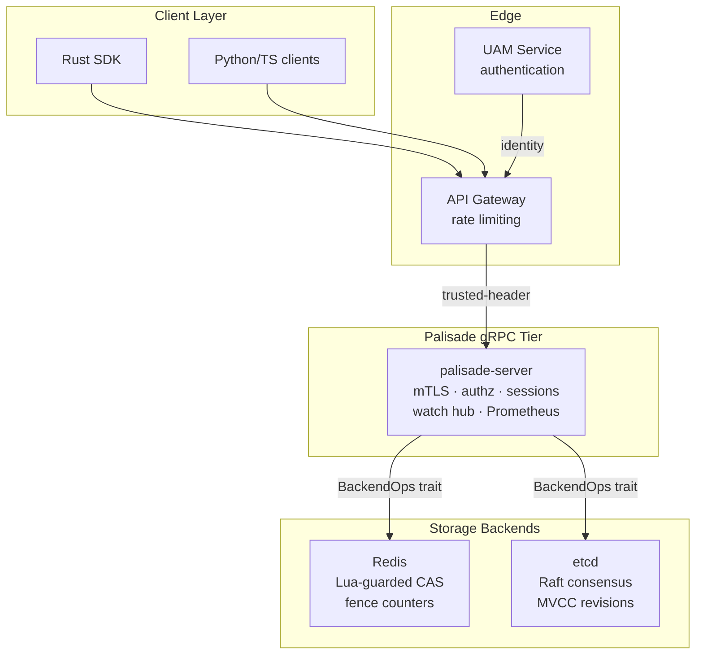
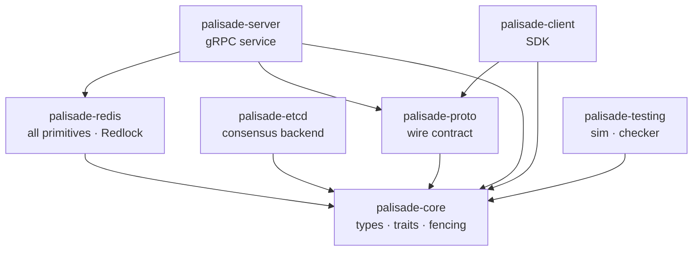
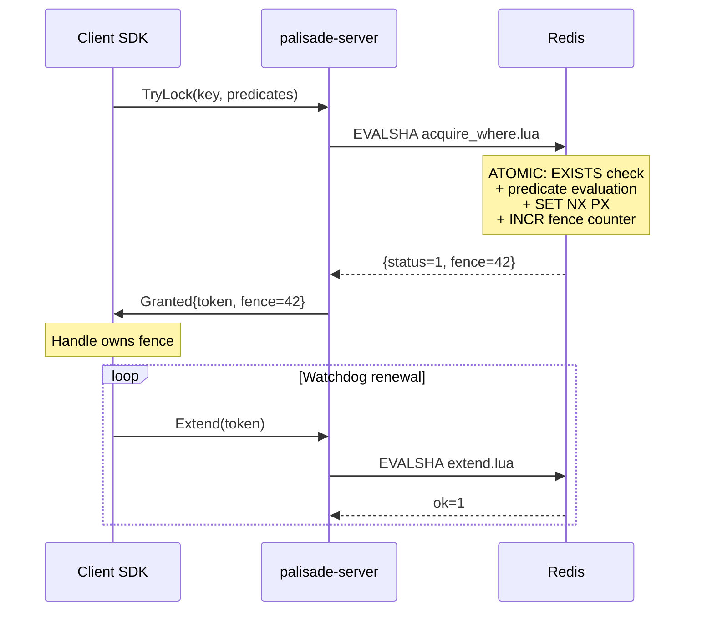
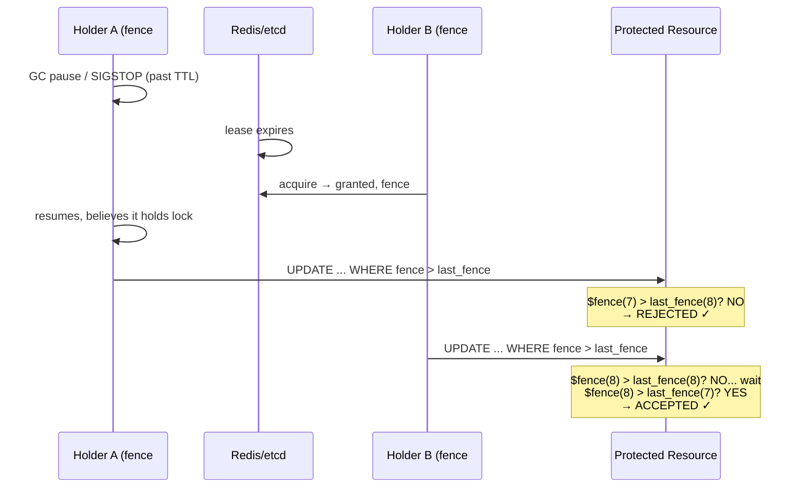
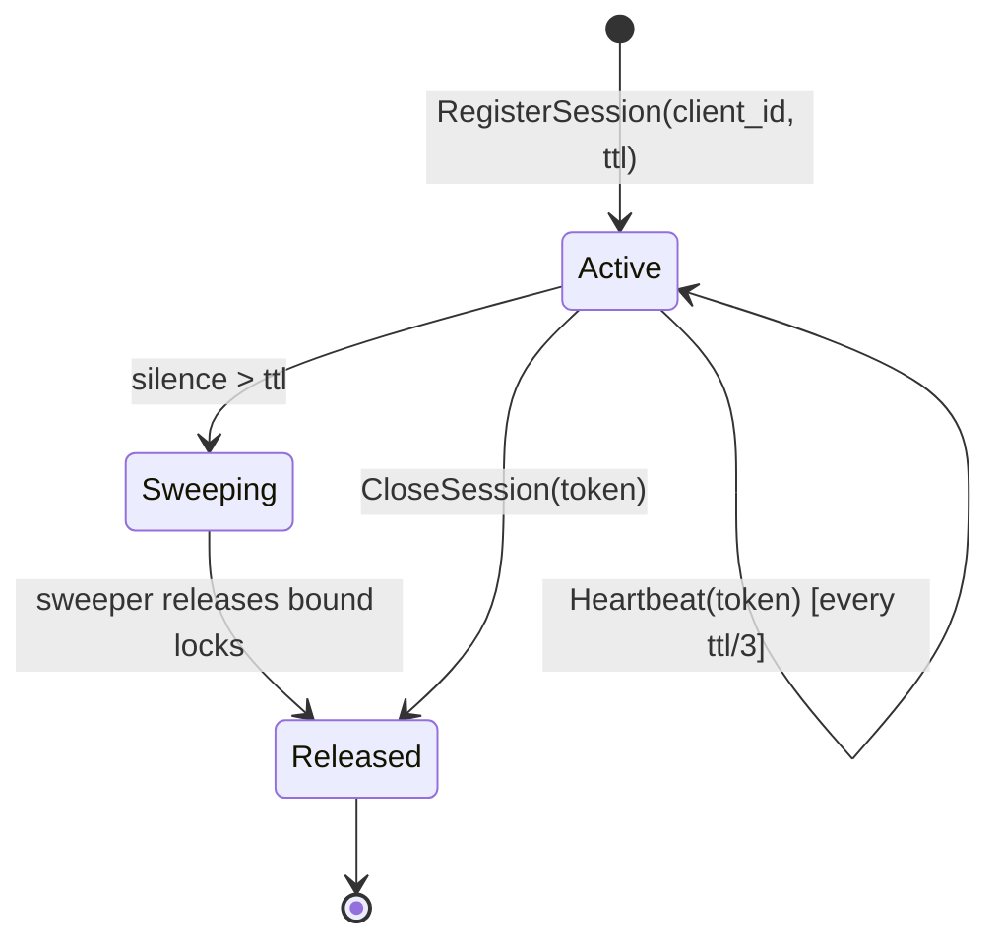
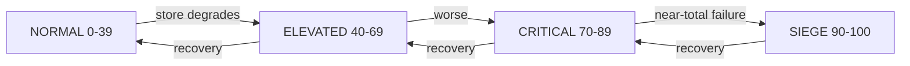
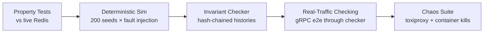

# Architecture

## System Overview

## Crate Dependency Graph

## Request Flow: Semantic Lock Acquisition

## Safety Model: The Fencing Protocol

## Session Lifecycle

## Degradation Tiers (Lock Lattice)

At each tier, consumers adapt:
| Tier | Gateway action | SDK watchdog cadence |
|---|---|---|
| NORMAL | full throughput | ttl/3 (1×) |
| ELEVATED | shed non-critical | ttl/2 (1.5×) |
| CRITICAL | queue new acquires | ttl×1.5 (2×) |
| SIEGE | circuit-break to fallback | ttl×2 (3×) |

## Correctness Verification Pipeline

